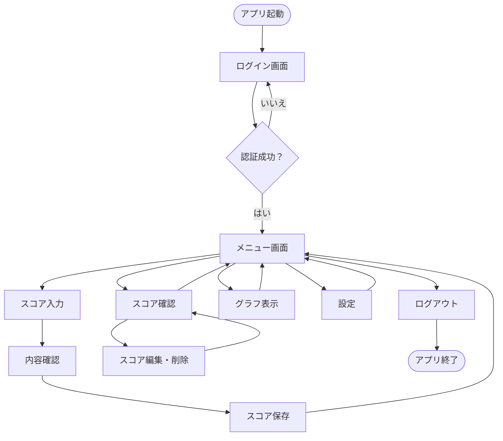

```mermaid
flowchart TD
    Start([アプリ起動])
    Login[ログイン画面]
    AuthCheck{認証成功？}
    Menu[メニュー画面]
    Input[スコア入力]
    Confirm[内容確認]
    Save[スコア保存]
    View[スコア確認]
    Edit[スコア編集・削除]
    Graph[グラフ表示]
    Settings[設定]
    Logout[ログアウト]
    End([アプリ終了])

    Start --> Login
    Login --> AuthCheck
    AuthCheck -- はい --> Menu
    AuthCheck -- いいえ --> Login

    Menu --> Input
    Input --> Confirm
    Confirm --> Save
    Save --> Menu

    Menu --> View
    View --> Edit
    Edit --> View
    View --> Menu

    Menu --> Graph
    Graph --> Menu

    Menu --> Settings
    Settings --> Menu

    Menu --> Logout --> End
```