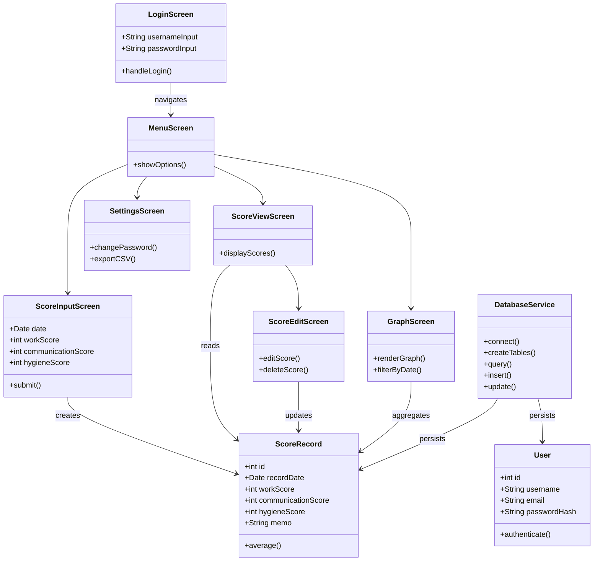

```mermaid
classDiagram
    %% UI layer
    class LoginScreen {
        +String usernameInput
        +String passwordInput
        +handleLogin()
    }
    class MenuScreen {
        +showOptions()
    }
    class ScoreInputScreen {
        +Date date
        +int workScore
        +int communicationScore
        +int hygieneScore
        +submit()
    }
    class ScoreViewScreen {
        +displayScores()
    }
    class ScoreEditScreen {
        +editScore()
        +deleteScore()
    }
    class GraphScreen {
        +renderGraph()
        +filterByDate()
    }
    class SettingsScreen {
        +changePassword()
        +exportCSV()
    }

    %% Domain layer
    class User {
        +int id
        +String username
        +String email
        +String passwordHash
        +authenticate()
    }
    class ScoreRecord {
        +int id
        +Date recordDate
        +int workScore
        +int communicationScore
        +int hygieneScore
        +String memo
        +average()
    }

    class DatabaseService {
        +connect()
        +createTables()
        +query()
        +insert()
        +update()
    }

    %% Relationships (navigation)
    LoginScreen --> MenuScreen : navigates
    MenuScreen --> ScoreInputScreen
    MenuScreen --> ScoreViewScreen
    MenuScreen --> GraphScreen
    MenuScreen --> SettingsScreen
    ScoreViewScreen --> ScoreEditScreen

    %% Model interactions
    ScoreInputScreen --> ScoreRecord : creates
    ScoreViewScreen --> ScoreRecord : reads
    ScoreEditScreen --> ScoreRecord : updates
    GraphScreen --> ScoreRecord : aggregates
    DatabaseService --> ScoreRecord : persists
    DatabaseService --> User : persists
```