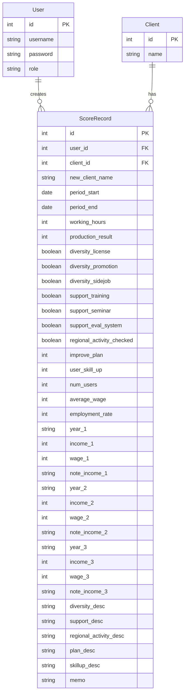

```mermaid
erDiagram
    User ||--o{ ScoreRecord : creates
    Client ||--o{ ScoreRecord : has

    User {
        int id PK
        string username
        string password
        string role
    }

    Client {
        int id PK
        string name
    }

    ScoreRecord {
        int id PK
        int user_id FK
        int client_id FK
        string new_client_name
        date period_start
        date period_end
        int working_hours
        int production_result
        boolean diversity_license
        boolean diversity_promotion
        boolean diversity_sidejob
        boolean support_training
        boolean support_seminar
        boolean support_eval_system
        boolean regional_activity_checked
        int improve_plan
        int user_skill_up
        int num_users
        int average_wage
        int employment_rate
        string year_1
        int income_1
        int wage_1
        string note_income_1
        string year_2
        int income_2
        int wage_2
        string note_income_2
        string year_3
        int income_3
        int wage_3
        string note_income_3
        string diversity_desc
        string support_desc
        string regional_activity_desc
        string plan_desc
        string skillup_desc
        string memo
    }
```