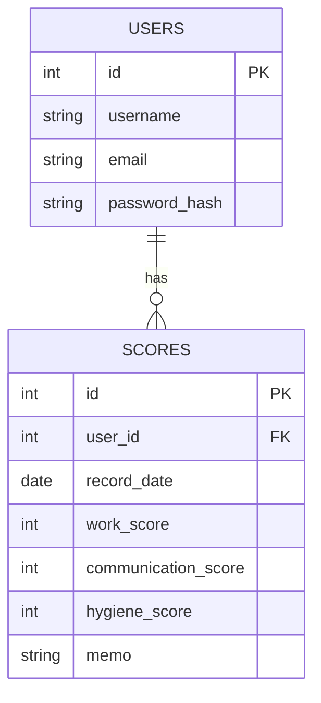

```mermaid
erDiagram
    USERS ||--o{ SCORES : has
    USERS {
        int id PK
        string username
        string email
        string password_hash
    }
    SCORES {
        int id PK
        int user_id FK
        date record_date
        int work_score
        int communication_score
        int hygiene_score
        string memo
    }
```